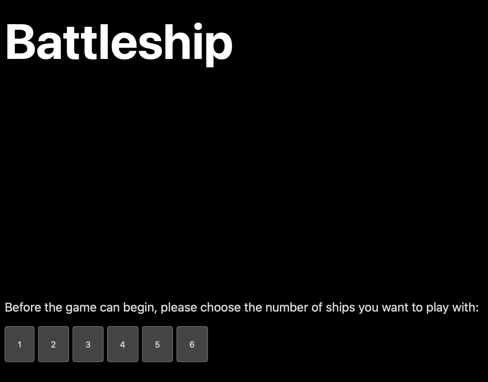
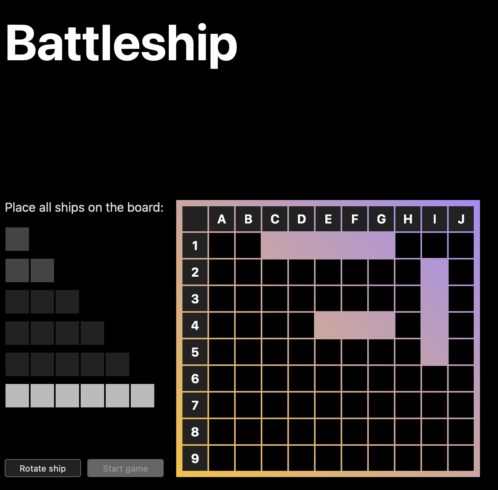
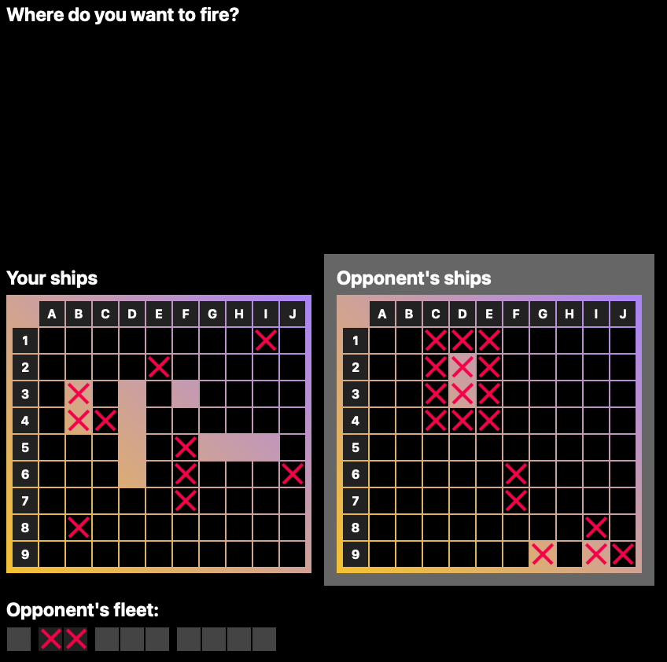
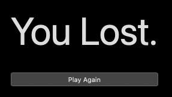

# EECS 448: Battleship

A simple turn-based game of war. Place up to 6 ships on a 9x10 grid and try to sink your opponent's ships before they sink yours.

[Live Demo](https://maxxxxxdlp.github.io/eecs-448-battleship/eecs-448-battleship/)

[Description of the development process](https://max.patii.uk/projects/battleship)

## Deployment and Documentation

See the docs in the [documentation directory](./documentation/)

## Screenshots

